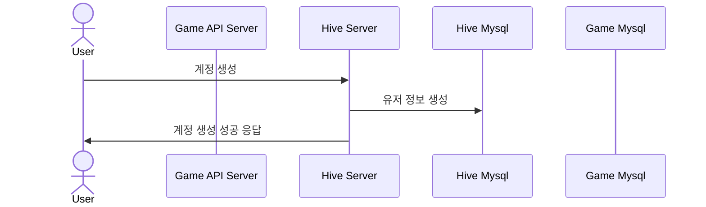
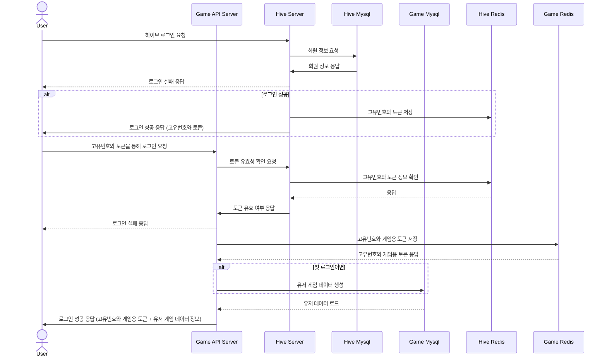

# GameServer
[송유진] 컴투스 서버 캠퍼스 2기

## 시퀀스 다이어그램
#### 새로운 유저의 계정 생성



#### 유저의 로그인



## DB 스키마
#### HiveServer

```sql
  use hivedb;

  CREATE TABLE account (
      userid INT AUTO_INCREMENT PRIMARY KEY,
      email VARCHAR(255) NOT NULL UNIQUE,
      password CHAR(64) NOT NULL,
      salt CHAR(64) NOT NULL
  );
```

#### GameAPIServer

```sql
  use gamedb;

  CREATE TABLE UserGameData (
      UserId VARCHAR(255) NOT NULL,
      Level INT NOT NULL DEFAULT 1,
      Exp INT NOT NULL DEFAULT 0,
      Win INT NOT NULL DEFAULT 0,
      Lose INT NOT NULL DEFAULT 0,
      PRIMARY KEY (UserId)
  );
```

## 공부 문서 
[ASP.NET core 문서](https://github.com/yujinS0/ASP.NETcore-Study)

---
### 2주차 체크박스
#### API 기능 구현
- [X] 계정생성 (hive server)
- [X] 로그인
  + Hive 서버 로그인 (hive server)
  + API Game 서버 로그인 (api game server)
    * 첫 로그인 시 기본 게임 데이터 생성
  + 인증 토큰 유효 검증 (hive server)
- [ ] 우편함
- [ ] 출석부
- [ ] 친구


#### 피드백
- [X] `program.cs`
  + 데이터베이스 서비스 등록할 때 class-interface 형식으로 받아오게해서 등록
- [X] `model`
  + Req/Res : success & message 제거 -> ErrorCode로 처리
    * 관련해서 controller의 로직들도 대폭 수정 필요!
- [X] `controller`
  + <IActionResult> 이렇게 보내는 경우 수정 : Req/Res 타입 바로 넣게
  + 로직 부분 여기서 처리하지 말기
    * controller / service / repository 적절히 분리하기!!
- [X] `repository`
  + 쿼리문 사용한 경우 -> KATA 사용으로 수정하기
  + 쿼리문에서 함수 처리하지 말기 -> server에서 처리하기
  + Redis 관련 라이브러리 CloudStructures로 변경하기
- [ ] 로그 관련 처리
  + 로그 레벨 확인 후 처리
