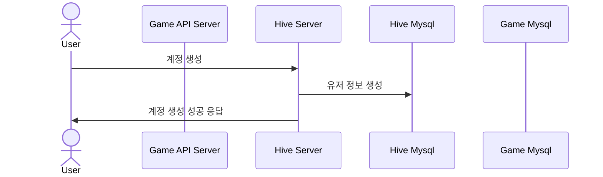
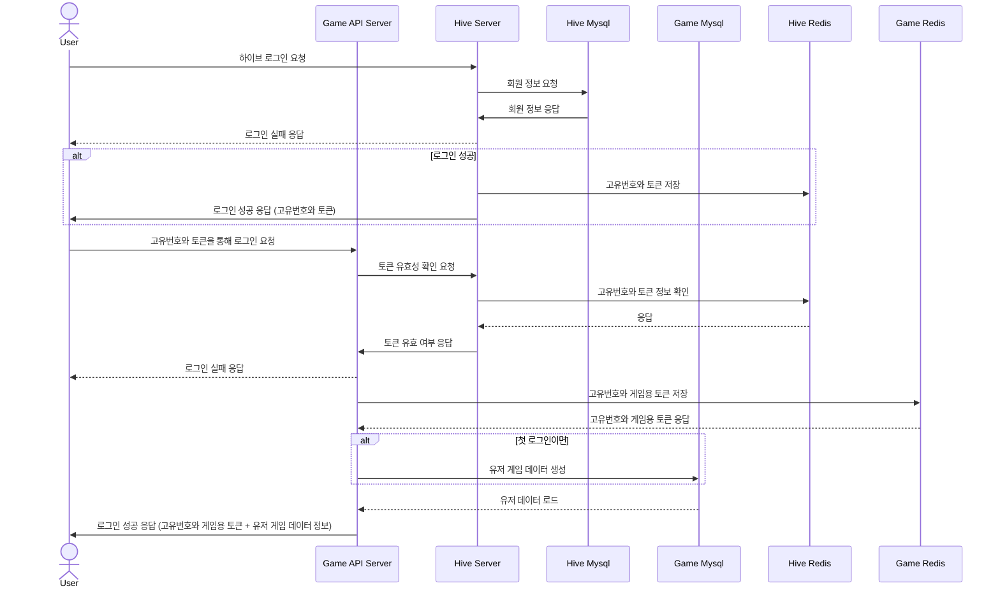

# 시퀀스 다이어그램
## 새로운 유저의 계정 생성

```mermaid
sequenceDiagram
	actor User
	participant Game API Server
	participant Hive Server
	participant Hive Mysql
  participant Game Mysql

	User ->> Hive Server: 계정 생성
	Hive Server ->> Hive Mysql : 유저 정보 생성
  Hive Server ->> User: 계정 생성 성공 응답
```

## 유저의 로그인

```mermaid
sequenceDiagram
	actor User
	participant Game API Server
	participant Hive Server
	participant Hive Mysql
  participant Game Mysql
  participant Hive Redis
  participant Game Redis

	User ->> Hive Server: 하이브 로그인 요청
  Hive Server ->> Hive Mysql : 회원 정보 요청
  Hive Mysql ->> Hive Server : 회원 정보 응답
	Hive Server -->> User : 로그인 실패 응답

  alt 로그인 성공
  Hive Server ->> Hive Redis : 고유번호와 토큰 저장
  Hive Server ->> User : 로그인 성공 응답 (고유번호와 토큰)
  end

	User ->> Game API Server : 고유번호와 토큰을 통해 로그인 요청
	Game API Server ->> Hive Server : 토큰 유효성 확인 요청
	Hive Server ->> Hive Redis : 고유번호와 토큰 정보 확인
	Hive Redis -->> Hive Server : 응답
	Hive Server ->> Game API Server : 토큰 유효 여부 응답

	Game API Server -->> User : 로그인 실패 응답
	
	Game API Server ->> Game Redis : 고유번호와 게임용 토큰 저장
	Game Redis -->> Game API Server : 고유번호와 게임용 토큰 응답

	alt 첫 로그인이면
	Game API Server ->> Game Mysql : 유저 게임 데이터 생성
	end
	Game Mysql -->> Game API Server : 유저 데이터 로드

	Game API Server ->> User : 로그인 성공 응답 (고유번호와 게임용 토큰 + 유저 게임 데이터 정보)
	


```

